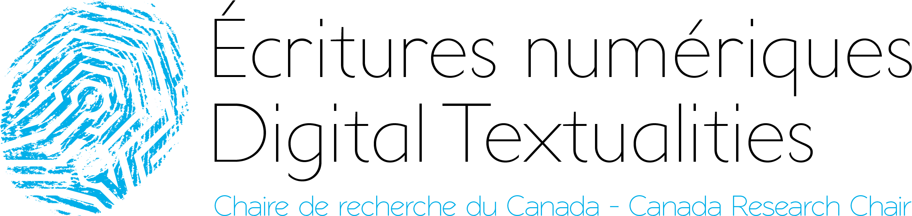
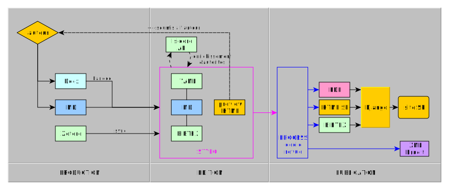
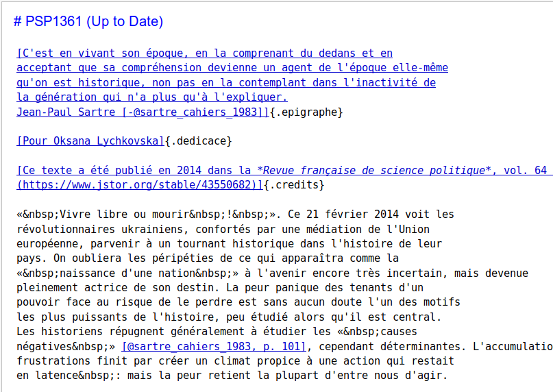
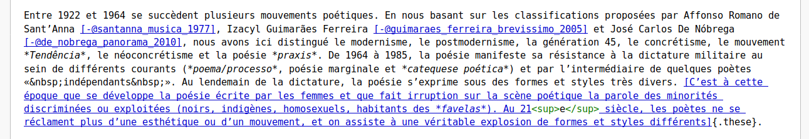
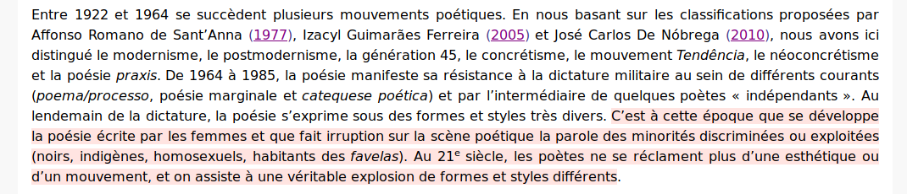
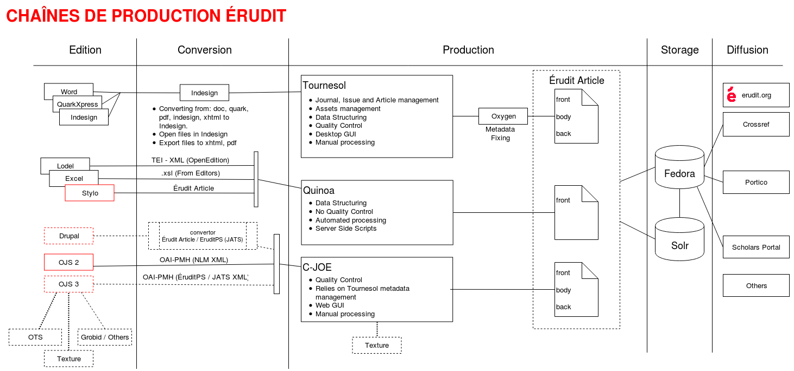
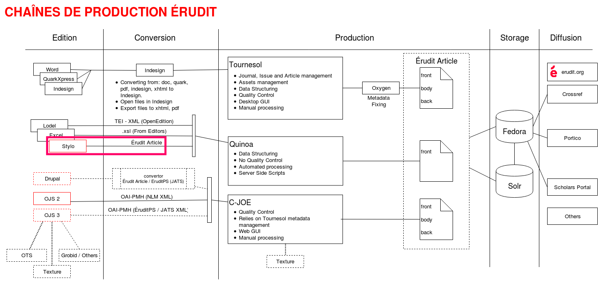

## Stylo

#### éditeur sémantique pour les humanités


<!-- ##### remettre l'édition scientifique dans les mains de l'auteur -->

> Dans l'environnement numérique,  
> écrire = écrire + structurer.

&nbsp;

---

Nicolas Sauret - présentation: [nicolassauret.net/s_StyloCRIHN](http://nicolassauret.net/s_StyloCRIHN)

<!-- .element: style="font-size:1.5rem" -->

_« Repenser les humanités numériques / Thinking the Digital Humanities Anew »_  
25-27 oct. 2018 | CRIHN, Montréal

<!-- .element: style="font-size:1.5rem" -->

 <!-- .element: class="logo" style="width:20%; background-color:ghostwhite;padding: 4px" --> 

===


§§§§§SLIDEmoveDown§§§§§
<!-- .slide: data-background-image="graphics/equipeecrinum.png" data-background-size="contain" -->
<!--  .slide: class="hover"-->

## un travail d'équipe <!-- .element: style="padding-top:0.8em" -->


%%%%%%%%%%%%%%%%%%SECTIONmoveRight%%%%%%%%%%%%%%%%%%
### Pourquoi
### tant de _Word_
### à l'université?

===
Je commence avec une question récurrente, pourquoi tant de word à l'université. L'outil d'écriture majoritaire des universités se trouve en effet être Word. On le retrouve partout, les formulaires d'inscriptions sont en Word, les plans de cours sont en Word, les prises de notes sont en Word, les étudiants écrivent leur dissertation sous Word, interligne double, les chercheurs écrivent leurs articles sous word, les éditeurs éditent les articles sous word. On trouve même des thèses en word.

Vous comprenez bien que dans ma question initiale, la catastrophe n'est pas Word, mais bien l'Université.

§§§§§SLIDEmoveDown§§§§§
### question institutionnelle
===
<!-- Or une réflexion expérimentée ou une expérimentation critique sur les outils d'écriture et d'édition sont doublement importants pour les universitaires, tant la mission première, en tant qu'institution, de l'Université est de prendre autant soin de l'écrit (les corpus) que de la chaîne de production de l'écrit. -->

 L’écrit est au cœur du fonctionnement de toute institution, c’est à la fois _ce sur quoi elle repose_ (sa condition d’existence), et _ce qu’elle certifie_ (sa raison d’être). À cela s’ajoute, pour l’institution scientifique ou l'université, _ce qu’elle étudie_.

Là où certaines institutions trouvent leur stabilité et pérennité dans une nécessaire inertie vis-à-vis de ses écrits et inscriptions, l’université a cette particularité de devoir adopter une position réflexive d'une part sur ses écrits, mais aussi d'autre part sur la chaîne de production de l’écrit, dont les processus contribuent à la légitimation.

Assumer cette réflexivité revient à consolider la légitimité des écrits et de l’institution elle-même. Au contraire, abandonner cette dernière préoccupation équivaut en quelque sorte à couper son cordon d’alimentation. En tant que garante _des écrits_ (les corpus, les archives, etc.) et _de l’écrit_ (en tant que procédé de production des corpus et des archives), elle ne peut légitimement exister que si elle accompagne les pratiques et les techniques d’écritures, si elle les analyse, et si elle en prescrit de nouvelles.

§§§§§SLIDEmoveDown§§§§§
### l'écrit et sa chaîne de production
===

Ainsi, plus que pour toute autre institution, la recherche sur la chaîne de production de l’écrit scientifique constitue ensemble sa mission, sa raison d’être et la condition de sa survie.

C’est ainsi, en tout cas, que nous considérerons l’institution, dans cette vision idéale et paradoxale d’une institution garante des écrits qu’elle assure en les stabilisant, les analysant et les interprétant, mais qui dans le même temps ne peut exister que dans la dynamique d’une remise en question de l’écrit, de sa chaîne de production et des techniques intellectuelles qui lui sont associées.

Au moment-même où les pratiques des chercheurs se transforment et s'adaptent dans un écosystème disrupté, les institutions scientifiques ne peuvent pas abandonner aux GAFAM la réflexion sur les supports et les techniques de l'écriture et de la lecture.


%%%%%%%%%%%%%%%%%%SECTIONmoveRight%%%%%%%%%%%%%%%%%%
<!-- .slide: data-background-image="graphics/stylo_facebook.png" data-background-size="contain" data-transition="slide-out"-->
<!-- .slide: class="hover" -->

## Qu'est-ce que Stylo ? <!-- .element: style="padding-top:0.8em"  -->
===

Fondamentalement, Stylo est né de cette catastrophe, et de la conviction que, en tant qu'universitaire, il convenait de prendre autant soin des écrits que l'on étudiaient que de la chaine de production de l'écrit. Stylo est notre expérimentation, notre bricolage local. C'est sans doute aussi un peu notre cheval de Troie dans l'Université, ou peut-être plus modestement, au sein du département de Littérature de langues françaises. Et ça marche !


§§§§§SLIDEmoveDown§§§§§
<!-- .slide: data-background-image="graphics/stylo_3f.png" data-background-size="contain" -->

===
Stylo est à la fois un outil de rédaction de texte scientifique et un outil d'édition de document scientifique. Cet agencement est permis par l'articulation de trois fichiers au coeur de son fonctionnement.

§§§§§SLIDEmoveDown§§§§§
<!-- .slide: data-background-image="graphics/stylo_3f_marqued.svg" data-background-size="contain" data-transition="fade-in slide-out"-->

===
- Le corps de texte, au format markdown
- La bibliographie, au format bibtex
- Les métadonnées, au format yaml


§§§§§SLIDEmoveDown§§§§§
<!-- .slide: data-background-image="graphics/stylo_fullopen_marqued.png" data-background-size="contain" data-transition="slide-in"-->

===
Je vous montre ici l'interface complète, où l'on retrouve un éditeur de métadonnées, un gestionnaire de références, capable de se synchroniser avec une collection zotero en ligne. Le corps de texte au centre,

Ainsi que plusieurs modules outillant nos trois sources : ajoutant des fonctionnalités de versionning, un sommaire, des statistiques sur le document et non visible ici un comparateur de version.

§§§§§SLIDEmoveDown§§§§§


### text/plain

>The primary subtype of text is "plain".  This indicates plain
> (unformatted) text."

> "An interesting characteristic of many such
representations is that they are to some extent readable even without
the software that interprets them.

> source : https://tools.ietf.org/html/rfc1521#section-7.1

<!-- .element: class="petit" style="text-align:left" -->


===
Stylo, c'est le choix du low tech, (et en passant du logiciel libre, les deux ne sont pas corrélés.)

Ainsi, les trois formats de fichier sont éditables en mode texte brut ou _plain text_. C'est un aspect important car c'est une excellente garantie de pérennité, nos sources sont et seront lisibles par toutes les machines. La seule interprétation machinique qui en est fait lors de leur lecture brute est éventuellement une coloration syntaxique permettant de mettre en évidence les syntaxes respectivent du markdown, du yaml et du bibtex.


<!-- Témoigne de la convergence des inscriptions, qu'elle soit programmative ou discursive. Certains ne font d'ailleurs aucune différence entre ces deux inscriptions, tant l'écriture demeure performative. -->

On aurait pu encapsuler ces trois fichiers dans un format .stylo ou .stl par exemple. Pourtant, maintenir la transparence sur ces trois fichiers sources nous semblent être davantage porteur de pérennité, de modularité, et de littératie, invitant les usagers à exploiter eux-mêmes les sources, à customiser les exports en jouant avec les paramètres et les filtres de pandoc, ou encore à publier les sources en ligne à travers un moteur de sites statiques comme Jekyll ou Hugo.

Ainsi, si Stylo facilite et rend plus accessible le process d'édition, de versionning, d'indexation, de conversion vers les formats d'usages, le choix a bien été de conserver un accès direct à la matérialité text/plain des fichiers markdown, bibtex et yaml. Outre la question de la pérennité des données, ce principe de ne pas masquer les formats et les fichiers va dans le sens d'une technique ouverte, c'est-à-dire visible. Cette transparence du medium est un premier pas pour la transmission de cette littératie du numérique (savoir-lire-écrire-et-structurer), tout le contraire finalement des formats propriétaires fermés.

<!-- , ou pire de l'applification ou appification de nos interfaces :

> applification : "to reduce user-end complexity by adopting the features of a mobile app".

Quand je lis "to reduce user-end complexity", j'entends "to reduce user-end capacity". -->


%%%%%%%%%%%%%%%%%%SECTIONmoveRight%%%%%%%%%%%%%%%%%%
<!-- .slide: data-background-image="graphics/lankes_sos.png" data-background-size="contain" -->


## Bricolage <!-- .element: style="color:#484848;" -->

===
Stylo n'invente rien, nous n'avons fait qu'exploiter et mettre ensemble des principes et des outils existants, nous avons bricolé une interface simple agenceant les différents formats et outils.

Et chacune de nos erreurs de bricolage sont des marches d'apprentissage. Petit clin d'oeil à Margot Mellet qui a courageusement édité la traduction de l'ouvrage de David Lankes, présentée jeudi aux Ateliers.

§§§§§SLIDEmoveDown§§§§§
<!-- .slide: data-transition="fade-in"-->


===
Voici le schéma de la chaine éditoriale de la revue Sens public aujourd'hui, je n'intègre pas le répertoire git sur lequel les éditeurs maintiennent et archivent les fichiers. On en a vu un petit aperçu à la slide précédente.

Plusieurs étapes avant d'arriver à ce résultat. La chronologie de la conception de cette chaine éditoriale est passée par plusieurs phases. Je ne vous ferai pas la chronologie de la conception de Stylo, bien trop longue..

§§§§§SLIDEmoveDown§§§§§
<!--  .slide: style="font-size:1.7rem"-->

### 03/2017 - preuve de concept <!-- .element style="color:orange" -->

- premiers tests de templates
- premiers articles édités

&nbsp;

```
---------- Forwarded message ---------
From: Marcello Vitali-Rosati <marcello.vitali.rosati@umontreal.ca>
Date: Sun, Apr 9, 2017 at 11:39 AM
Subject: eden
To: Servanne Monjour <servanne.monjour@wanadoo.fr>


tu veux la faire travailler sur la nouvelle chaine? Si oui, dis-lui
d'installer atom avec extension markdown et pandoc sur son ordi. Et de
regarder markdown.
```
===
en mars 2017, premiers tests, première preuve de concept, on teste sur quelques articles simples


§§§§§SLIDEmoveDown§§§§§
<!--  .slide: style="font-size:1.7rem"-->

### 04/2017 - mise en production <!-- .element style="color:orange" -->

  - ouverture d'un répertoire dédié à la chaîne.
  - premier jet du protocole éditorial: succession de commandes pandoc
  - formation des éditeurs : éditeur de texte (Atom) + pandoc + dropbox

&nbsp;


```
commit 2788784a8f6061a8a05cc1bfef508ef7629218c7
Author: marviro <marcello@vitalirosati.net>
Date:   Wed Apr 19 13:37:45 2017 -0400

    ajout templates, protocoles, yaml et xslt - mise à jour readme
```
===

dès le mois d'avril, est élaboré un premier protocole éditorial auquel les éditeurs de Sens public, principalement des étudiants en littérature françaises (!), sont formés.

§§§§§SLIDEmoveDown§§§§§
<!--  .slide: style="font-size:1.7rem"-->

### 12/2017 - formalisation <!-- .element style="color:orange" -->

  - ouverture d'un répertoire dédié aux contenus
  - consolidation du protocole éditorial:
    - workflow git
    - intégration des règles éditoriales

&nbsp;


```
commit 3288dfdee0cd59078adcb45ef715d6ded5bf0417
Author: lakonis <nnicolaoss@gmail.com>
Date:   Thu 2017 Dec 21 14:16:50 2017 -0500

    Initialisation dossier Edition à partir de Dropbox 21dec2017
```
===
décembre 2017, nous ouvront un répertoire git dédié aux contenus.

§§§§§SLIDEmoveDown§§§§§
<!--  .slide: style="font-size:1.7rem"-->

### 01/2018 - formation et mise en production <!-- .element style="color:orange" -->

  - wiki, construction d'une base de connaissances
  - scripting des commandes
  - formation des éditeurs à git

&nbsp;


```
commit 4ac7bd604fc06481165a544fe895ca84ce1c842f
Author: laconis <nnicolaoss@gmail.com>
Date:   Mon Jan 22 20:51:41 2018 -0500

    création 2 scripts conversion html: bash+local
```

```
commit 562a69b99c453f1f49011ab1b51af350761d5fd9
Author: Eugénie Matthey-Jonais <eugeniematthey-jonais@MacBook-Pro-de-Eugenie.local>
Date:   Thu Jan 25 15:31:55 2018 -0500

    SP1293 : initialisation du dossier
```
===
en janvier 2018, les étudiants sont formés au workflow git, et l'on ouvre un wiki qui va leur permettre de co-construire une base de connaissance sur la chaine.

§§§§§SLIDEmoveDown§§§§§
<!--  .slide: style="font-size:1.7rem"-->

### 04/2018 - Stylo en version alpha <!-- .element style="color:orange" -->

  - présentation au colloque _Ecridil_
  - tests utilisateurs, améliorations

&nbsp;

### 06/2018 - Formation des éditeurs à Stylo <!-- .element style="color:orange" -->

  - intégration de _Stylo_ dans le protocole éditorial
  - production de _Process_ : web-service de traitement (pandoc + Saxon)

  &nbsp;

### 09/2018 - intégration de _Process_ dans le protocole
<!-- .element style="color:orange" -->

===
en avril 2018, Stylo est présenté en version alpha au colloque Ecridil, et deux mois plus tard, nous intégrons l'outil dans le protocole éditorial de la revue Sens public. À cette occasion, marcello développe un simple script bash pour automatiser les exports de Stylo, qui sera ensuite hébergé sur un docker pour en faire un web-service de traitement.

Finalement en septembre 2018, Process est intégré dans le protocole, cad utilisé par les éditeurs eux-mêmes.

%%%%%%%%%%%%%%%%%%SECTIONmoveRight%%%%%%%%%%%%%%%%%%

## Modularité

===
Ce que montre avant tout cet historique, c'est la modularité de la chaine, principe que l'on reprend du mémoire d'Antoine, modularité tant les formats utilisés, les outils qui implémentent ces formats, et les logiciels de traitements sont interchangeables.


§§§§§SLIDEmoveDown§§§§§

<i class="fa fa-arrow-right"></i> 3 éléments principaux + modules techniques :

<!-- .element: style="font-size:0.8em;" -->

1. **Éditeur de métadonnées**
  - yaml <!-- .element: style="color:Darkorange;" -->
  - DC, RDFa, Foaf,
    ScholarlyArticle, Google Scholar, Prism schema <!-- .element: style="color:Darkorange;" -->
  - Vocabulaire contrôlé
  - Alignement avec des autorités (Rameau, Wikidata, LOC)
  - Via l'API rechercheisidore (Huma-num)
2. **Éditeur de texte** avec balisage interne
  - Markdown enrichi <!-- .element: style="color:Darkorange;" -->
  - autres ?
3. **Gestion bibliographique**
  - BibTeX <!-- .element: style="color:Darkorange;" -->
  - Api Zotero

<!-- .element: style="font-size:0.6em; width:55%; float:left;" -->


1. **Conversion**
  - pandoc <!-- .element: style="color:Darkorange;" --> (vers html, LateX, pdf)
  - XSLT <!-- .element: style="color:Darkorange;" --> (vers TEI-LOD, Erudit)
2. **Versioning**
  - git <!-- .element: style="color:Darkorange;" -->
  - comparateur de versions
3. **API**


<!-- .element: style="font-size:0.6em; width:35%; float:left;padding-left:2rem;border:1px,solid,white;" -->

===
Sans m'y attarder, voici les différents briques logicielles, les différents formats, les différents services qui sont articulés dans Stylo.
Au fur et à mesure de la conception, nous avons pu remplacer un outil par un autre, nous avons pu améliorer ou optimiser tel ou tel aspect de la chaîne.

Autant la chaîne que Stylo ou Process sont des outils et des protocoles encore en friche.

Par ailleurs, ce que n'a pas montré cette chronologie, c'est l'enrichissement permanent depuis avril 2017 du modèle de données et de métadonnées des articles.

§§§§§SLIDEmoveDown§§§§§
<!-- .slide: data-background-image="graphics/log_template.png" data-background-size="contain"-->

## Souplesse
===
Le choix du markdown/yaml et du html au détriment peut-être d'un modèle XML au schéma déclaré et stabilisé a été d'abord celui d'une extrême souplesse nécessaire à l'expérimentation. Ce processus d'élaboration d'un modèle éditorial, celui de la formalisation de nos métadonnées et des templates associés a été un processus itératif, souple et peu contraignant.

Cela nous a permis de démarrer très vite la production d'articles, d'identifier des cas de figure particulier, et de réintégrer dans la chaine : de nouvelles données, nouveaux champs et nouvelles balises.

La chaine md+yaml+bib existe depuis bientôt 18 mois, 18 mois pendant lesquels les champs du yaml n'ont cessés d'être mis à jour au fur et à mesure des besoins identifiés. Stylo a largement bénéficié de ces itérations pendant sa conception.

Mais cette souplesse a bien entendu sa limite. Itérer sur les données ou sur les templates suppose de rééditer, ou de mettre à jour, les articles antérieurs à l'itération et de relancer les conversions. Encore aujourd'hui, presque 18 mois après la mise en oeuvre de la chaîne, et 5 mois après son adoption par l'équipe de Sens public, nous continuons d'améliorer certaines syntaxes, d'enrichir les templates, voir de créer des filtres ad-hoc pour gérer les multiples cas de figures.

§§§§§SLIDEmoveDown§§§§§

 <!-- .element: width="90%" -->

===
La preuve de concept initiale se ramifie au fil des enrichissements que nous intégrons au texte et aux métadonnées :
- utilisation d'autorités (orcid, Rameau) dans les métadonnées
- utilisation de services d'enrichissement (Isidore à la demande) pour qualifier les articles
- [next slide]

§§§§§SLIDEmoveDown§§§§§

 <!-- .element: width="100%" -->
 <!-- .element: width="100%" -->


===

- sémantisation du corps de texte
- références structurées via l'api de zotero

Ce bricolage constant est important. Les éditeurs de la revue peuvent en témoigner, ils sont eux-mêmes obligés de se salir les mains. Mais ces mains pleines de cambouis, de balises, de commandes bash, de branches fusionnées, sont les témoins de leur capacitation, d'une nouvelle maîtrise qui va bien au-delà de l'édition d'un document.

§§§§§SLIDEmoveDown§§§§§
<!-- .slide: data-background-image="graphics/variations.png" data-background-size="cover"-->

===
Dans leur critique des Humanités numériques, publié dans la revue Variations, Fabien Granjon et Christophe Magis consacre une partie conséquente de leur papier à cette double relation assumée qu'entretiennent les humanités numériques avec la praxis et la théorie. Les auteurs appellent à se méfier de l'épistémologie du faire, du doing, du making, du building, qui selon eux ne permet pas une distance consciente suffisante avec le monde pour en être critique.

Il me semble au contraire que de tels bricolages, qui sont très certainement au coeur d'une démarche DH, favorise la réflexivité d'une part sur les techniques et les pratiques employées, et d'autre par sur le monde et le milieu technique dominant. Ces mains _dans_ (le cambouis ou le numérique) participent à légitimer le discours _sur_ (le numérique).


%%%%%%%%%%%%%%%%%%SECTIONmoveRight%%%%%%%%%%%%%%%%%%
## Ruptures - pourquoi tant de maux ?

===
Mais revenons au tout début. Pourquoi tant de Word, autrement dit, pourquoi tant de maux.

Au tout début de Stylo, un constat et une frustration : de l'auteur au diffuseur en passant par l'éditeur, l'article scientifique dans les sciences humaines passe par des états et des formats tellement différents que ce processus, ou cette chaine éditoriale, engendre tout à la fois une perte considérable de temps, de données et de signification.


Nos différentes discussions avec les différents acteurs de cette chaine, les chercheurs, les éditeurs de revues ou encore les diffuseurs, montrent un paradoxe. L'ensemble de ces acteurs, tout en adhérant au constat d'une chaîne défectueuse sur le plan scientifique, défendent une professionalisation de l'édition, sous-entendu une séparation et une spécialisation des rôles dans le processus de production du document.

Cela s'entend. Pourtant, du docx très souvent mal stylé par l'auteur, comportant une bibliographie non structurée et non articulée au corps de texte, jusqu'à l'épreuve pdf finale, le texte et ses données associées subissent une série de ruptures nécessitant différentes étapes successives d'interprétations, parfois documentaires, parfois scientifiques, qui mettent à mal ce principe de la professionnalisation.

§§§§§SLIDEmoveDown§§§§§
## Dépossession de l'auteur
===
Ce que l'on observe le long d'un tel processus, c'est que l'auteur est progressivement dépossédé de son texte, dans le mesure où il est rapidement incapable d'intervenir dans ces multiples processus d'interprétation. Pour être plus précis, on lui demande le plus souvent d'intervenir dans la marge des épreuves successives, sur la base de ce qu'il voit, ce qui est visible, avec une capacité d'intervention réduite voir nulle.

§§§§§SLIDEmoveDown§§§§§
## Dépossession de l'éditeur
===
Que l'auteur en soit dépossédé, cela pourrait encore se défendre, l'éditeur pourra y trouver matière à justifier sa fonction. Malheureusement, cette logique de dépossession du texte et de sa structure se retrouve également au niveau de l'éditeur qui délèguent en fait le véritable travail de structuration du texte et des métadonnées au diffuseur, qui lui entreprend effectivement un travail conséquent d'interprétation de fichier. Dans une telle situation, l'éditeur concentre ses efforts sur la production non pas d'un document, mais d'un texte, correctement écrit sur le plan linguistique, orthographique, sémantique. Il travaille avec l'auteur son texte, mais ne déborde pas sur la fabrique du document lui-même.

On peut alors considérer que l'éditeur a capitulé sur sa fonction d'intermédiation entre un auteur et un lectorat, puisque l'on sait depuis les travaux de Jeanneret et Souchier sur l'énonciation éditoriale que la structuration du texte, son organisation sur le support, autrement dit sa matérialité participe de l'existence matérielle, sociale et culturelle du texte.

§§§§§SLIDEmoveDown§§§§§
<!-- .slide: data-transition="fade-out" -->



===

Quid de Stylo ? quid de la chaîne éditoriale de la revue Sens public ? Actuellement Sens public est l'unique revue à livrer à Erudit, diffuseur des revues scientifiques québécoises, ses articles, métadonnées et corps de texte compris, dans le format d'archivage et de diffusion d'Erudit. Toutes les autres revues laissent au diffuseur le soin de structurer et de formater leurs contenus.

La situation n'est pas aussi problématique en France où Open Editions a mis en place des dynamiques vertueuses de formation et de formatage des contenus.

On parle de professionalisation de l'édition, mais a-t-on vraiment des éditeurs professionnels ? on peut trouver très problématique le fait que l'éditeur ne maitrise pas la facon dont son travail existera culturellement, socialement, mais aussi techniquement dans un environnement dépendant de plus en plus des données liées au texte.

Faire exister un texte dans l'environnement numérique suppose d'exposer des données suffisament riches et pertinentes pour que les contenus soient indexées par les moteur de recherche.

§§§§§SLIDEmoveDown§§§§§
<!-- .slide: data-transition="fade-in" -->


===

Quid de Stylo ? quid de la chaîne éditoriale de la revue Sens public ? Actuellement Sens public est l'unique revue à livrer à Erudit, diffuseur des revues scientifiques québécoises, ses articles, métadonnées et corps de texte compris, dans le format d'archivage et de diffusion d'Erudit. Toutes les autres revues laissent au diffuseur le soin de structurer et de formater leurs contenus.

La situation n'est pas aussi problématique en France où Open Editions a mis en place des dynamiques vertueuses de formation et de formatage des contenus.


On parle de professionalisation de l'édition, mais a-t-on vraiment des éditeurs professionnels ? on peut trouver très problématique le fait que l'éditeur ne maitrise pas la facon dont son travail existera culturellement, socialement, mais aussi techniquement dans un environnement dépendant de plus en plus des données liées au texte.

Faire exister un texte dans l'environnement numérique suppose d'exposer des données suffisament riches et pertinentes pour que les contenus soient indexées par les moteur de recherche.

%%%%%%%%%%%%%%%%%%SECTIONmoveRight%%%%%%%%%%%%%%%%%%
<!-- .slide: data-background-image="graphics/network_master.png" data-background-size="contain"-->

## Continuité <!-- .element: style="color:#484848;" -->

===
Stylo défend une autre vision, dans laquelle chacun des acteurs, de l'auteur au diffuseur, est susceptible d'intervenir dans le processus de production du texte, du début à la fin. Cela est possible grâce au partage d'un format pivot unique, simple d'accès et d'utilisation, et suffisament riche pour l'édition de textes scientifiques en sciences humaines.

§§§§§SLIDEmoveDown§§§§§
<!-- .slide: data-background-image="graphics/source_html.png" data-background-size="contain"-->

### écrire = écrire + structurer <!-- .element: style="color:#484848;" -->

===
Dans cette vision, l’écriture ne se résume plus seulement à écrire. Ecrire dans l'environnement numérique participe d'une dynamique d'édition, autrement dit l'acte d'écriture s'accompagne nécessairement d'un acte d'édition. Cette idée que écrire = écrire + structurer nous rapproche d'une culture de l'éditorialisation en tant que processus de production de l'espace numérique.

Cette culture n'est rien d'autre que la littératie numérique qui ajoute au savoir-lire-et-écrire la maîtrise du milieu d’écriture, une capacité à inscrire l’espace autant qu’à le structurer. Il s'agit de savoir autant évoluer dans cet environnement (l'habiter) que de le faire évoluer (le designer).

§§§§§SLIDEmoveDown§§§§§

### vers une nouvelle _epistémé_

===

On l'a vu, l'université se doit de mener une réflexion sur les pratiques et les outils d'écritures et de lecture.

C'est dans ce sens qu'a été lancé le projet Revue 2.0, associant des éditeurs (8 revues pilotes), les deux diffuseurs principaux de l'édition scientifique francophone en SHS (Erudit et Open Editions) et ce qu'on a appelé dans ce projet un agrégateur, Huma-num. L'objectif de ce projet sur trois ans, sera double : proposer un modèle épistémologique pour la revue savante à l'ère du numérique, et élaborer et expérimenter des modèles éditoriaux exploitant tous les potentiels de l'environnement numérique.

Beaucoup de sujets ont été abordés lors de nos premiers ateliers de travail, mais je retiens entre autres choses le chantier encore largement ouvert de l'émancipation des professionnels de la communication scientifique en matière d'éditorialisation et d'édition en réseau. En matière d'ouverture aussi, pas tant des contenus, puisque la raison et l'open access finissent toujours par l'emporter, mais en matière d'ouverture des process, notamment celui de la recherche en train de se faire, ou du bricolage en train de faire.

Pendant nos échanges avec les éditeurs, s'est exprimé une culture de l'intime, de l'échange humain, qui prétend vouloir ainsi résister à l'automatisation, à la massification (des contenus, des lectorats), et défendant à demi-mots l'excellence des idées, excellence légitimée sous couvert d'une certaine conception de la scientificité, conception en double-aveugle, autrement dit trouble. Je me sens autorisé à dire de telles choses ici parce je le pense d'une part, mais surtout parce que ce colloque s'est ouvert avec le prix JC Guédon, héros local et hérault du libre accès, prix remis à un article important car insistant sur le fait que d'autres formes d'évaluation sont souhaitables.

En particulier en Sciences humaines, ou le boulot des chercheurs, fondamentalement, c'est de discuter des idées. En acceptant le fait que toute idée est discutable. Il est temps donc que ces conversations qui s'exprime par word interposés dans le vase clos du workflow éditorial soient ouvertes au grand jour. Pour le meilleur.

Ces résistances de la part des praticiens sont pourtant bien compréhensibles. Elles sont celles du modèle épistémologique précédent, préexistant à l'environnement numérique, façonné sur plusieurs siècles. Dans cette opposition assez classique de l'ancien et du nouveau, est en train de se rejouer la résistance des scriptoriums face aux presses. Opposition classique, mais quelque peu réactionnaire. Car, face aux gouvernances algorithmiques très justement décriées, ouvrir le process de la pensée et ouvrir les contenus à l'appropriation et à l'interprétation grâce à des dispositifs numériques est une forme de résistance autrement plus efficace que le papier. Ainsi, si les acteurs et les actrices des revues ont bien un rôle à jouer, c'est celui de co-concevoir, de co-designer de nouveaux dispositifs numériques pour l'appropriation, la circulation, et la  conversation des connaissances.

C'est en celà, et en celà seulement, que cette fameuse fonction éditoriale, cad leur autorité, ou leur raison d'être, pourra se renouveller et remonter quelques marches de médiation dans un écosystème qui n'est pas désintermédié, mais au contraire fortement réintermédié par quelques acteurs silico-vallonnés, qui ont bien saisi eux le changement de paradigme.

Si l'environnement d'écriture et d'édition change aussi radicalement, c'est bien aux éditeurs eux-mêmes de proposer des modèles épistémologiques alternatifs, alternatifs à celui qui dominait ces derniers siècles, mais alternatifs surtout à ceux qui se sont installés ces dernières années.


%%%%%%%%%%%%%%%%%%SECTIONmoveRight%%%%%%%%%%%%%%%%%%
### Merci !


<i class="fa fa-arrow-right"></i> contribuer : [github.com/EcrituresNumeriques/stylo/](https://github.com/EcrituresNumeriques/stylo/)

<!-- .element: style="font-size:0.7em;" -->

<i class="fa fa-arrow-right"></i> écrire : [stylo.ecrituresnumeriques.ca](http://stylo.ecrituresnumeriques.ca/)

<!-- .element: style="font-size:0.7em;" -->

<i class="fa fa-arrow-right"></i> premiers pas : [stylo-doc.ecrituresnumerique.ca](http://stylo-doc.ecrituresnumerique.ca)

<!-- .element: style="font-size:0.7em;" -->


---
 <!-- .element: class="logo" style="width:25%; background-color:ghostwhite;padding: 7px" -->


%%%%%%%%%%%%%%%%%%SECTIONmoveRight%%%%%%%%%%%%%%%%%%

<i class="fa fa-arrow-right"></i> tuto : [youtu.be/qcwEqbcxBF8](https://www.youtube.com/watch?v=qcwEqbcxBF8)
